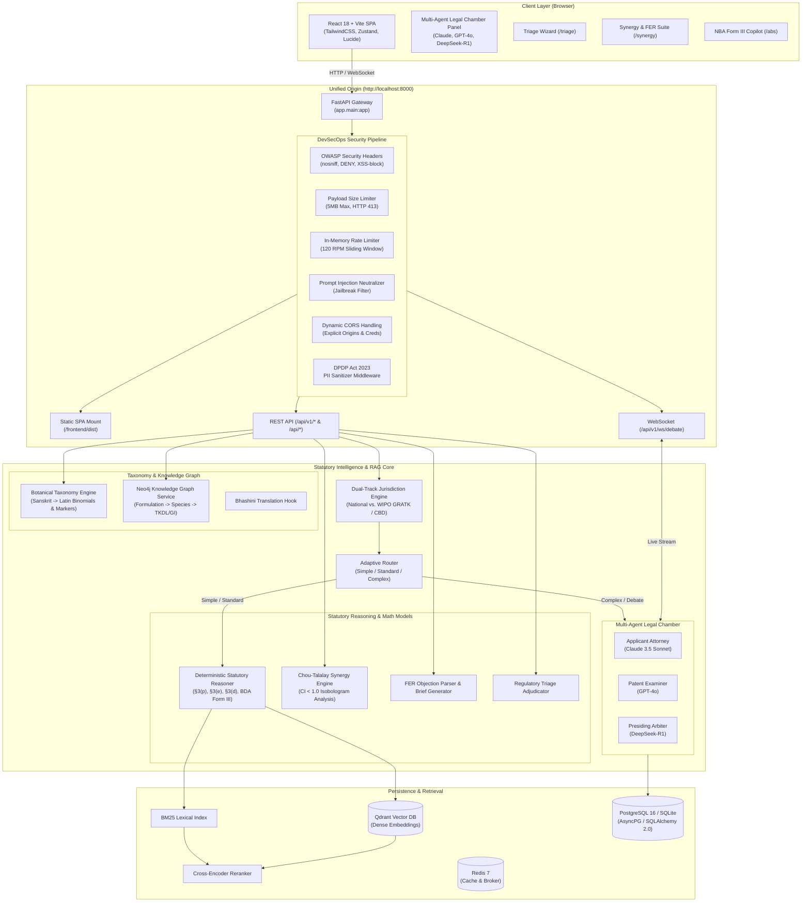

# Ayur-Lex-AI: Specialized Indian Patent Law & Ayurvedic IPR Engine

[](https://www.python.org/downloads/)
[](https://fastapi.tiangolo.com)
[](https://react.dev/)
[](https://vitejs.dev/)
[](https://qdrant.tech/)
[](https://www.postgresql.org/)
[](#7-dpdp-act-2023-pii-redaction--attorney-escalation-dossier)
[](#devsecops--multi-layer-security-hardening)
[](LICENSE)

An enterprise-grade, domain-grounded legal AI system designed for Indian Intellectual Property Rights (IPR), Patentability Assessments, and Regulatory Compliance across Ayurvedic, phytopharmaceutical, and herbal biotechnology innovations.

---

## Key Highlights

- **Strict Indian Statutory Grounding**: Zero generic textbook replies. Every query is statutorily contextualized with the **Indian Patents Act 1970** (§3(p) TKDL, §3(e) mere admixture, §3(d) therapeutic efficacy) and the **Biological Diversity Act 2002** (Form III NBA approval).
- **Multi-Agent Legal Chamber (Tribunal Debate)**: Simulates a real-time courtroom hearing over WebSockets between three specialized LLM agents:
  - **Applicant Attorney** (`Claude 3.5 Sonnet`): Advocates novelty, synergistic extraction, and technical bio-efficacy.
  - **Patent Examiner** (`GPT-4o`): Raises §3(p), §3(e), §3(d), and NBA clearance objections under CGPDTM guidelines.
  - **Presiding Arbiter** (`DeepSeek-R1`): Delivers binding legal determinations, claim amendments, and compliance roadmaps.
- **Dynamic Formulation & Regulatory Triage Wizard**: Classifies formulations into 5 distinct statutory pathways: Classical Medicine (§3(p) TKDL), Patent or Proprietary (P&P) Medicine (§3(e) synergy), Phytopharmaceuticals (CDSCO Rule 122E / §6 BDA), Ayurveda Aahar (FSSAI 2022 non-therapeutic), and Cosmetics (Schedule S carrier novelty).
- **Dual-Track Jurisdiction Switch**: Instantly toggles between **National Track** (Indian Patents Act, BDA 2002, AYUSH) and **International Track** (WIPO GRATK Treaty 2024, CBD / Nagoya Protocol, US FDA Botanical Drug Guidance, EMA Herbal Monographs).
- **Biological Diversity Act (BDA) & NBA Form Auto-Copilot**: Distinguishes Section 3(2) foreign shareholding/management from Section 7 domestic entities and auto-prefills ready-to-file **NBA Form III (Rule 18)** datasets for patent applications.
- **Section 3(e) Chou-Talalay Synergy Calculator & FER Rebuttal Parser**: Mathematically computes the Combination Index ($CI < 1.0$) to clear mere admixture hurdles and auto-generates formal written counter-arguments to Indian Patent Office First Examination Reports.
- **DPDP Act 2023 PII Redaction & Attorney Escalation Dossiers**: Automatically sanitizes Aadhaar, PAN, emails, phone numbers, and formula codes before LLM inference, and compiles courtroom-grade Markdown/JSON handoff dossiers for Registered Patent Agents.
- **DevSecOps & Multi-Layer Security Hardening**: Non-breaking defense-in-depth pipeline featuring OWASP security headers, a 5MB payload size limiter (HTTP 413), an in-memory sliding-window rate limiter (120 req/min with RFC telemetry headers), regex-based prompt injection/jailbreak neutralizer, dynamic CORS with wildcard bans on authenticated origins, safe startup credential masking, and DOMPurify XSS defense.
- **Botanical Taxonomy & Knowledge Graph Topology**: Sanskrit-to-Latin binomial taxonomy mapping with bioactive chemical markers, Neo4j formulation subgraphs, and Bhashini vernacular translation scaffolding.
- **Interactive Clarification & Direct Follow-up Dispatch**: Generates dynamic follow-up prompt chips on assistant responses. Clicking any chip immediately dispatches the inquiry to the reasoning pipeline with auto-scroll and concurrent request locks.
- **Cache-Control & Zero-Stale Client Architecture**: Root and SPA catch-all routes enforce `Cache-Control: no-cache, no-store, must-revalidate, max-age=0` to eliminate stale asset caching across browsers, paired with resilient dual-track jurisdiction telemetry (`India (National)` vs `international`).
- **Unified Single-Origin Architecture**: Serves both the React SPA frontend and FastAPI backend under a single port (`http://localhost:8000/`) with zero CORS overhead and built-in client-side SPA routing.

---

## Architecture Overview



---

## Statutory Grounding Framework

Ayur-Lex-AI enforces statutory rigor at every layer of generation. Generic legal definitions are intercepted and framed under Indian and international statutes:

| Statute & Provision | Regulatory Rule | System Verification & Requirement |
| :--- | :--- | :--- |
| **Indian Patents Act 1970, §3(p)** | Inventions which in effect are traditional knowledge or an aggregation/duplication of known properties. | Cross-checked against **TKDL** (Traditional Knowledge Digital Library). Pure extracts or classical formulations are non-patentable. |
| **Indian Patents Act 1970, §3(e)** | Substances obtained by a mere admixture resulting only in aggregation of properties. | Requires quantitative synergism evidence (**Chou-Talalay Combination Index** $CI < 1.0$, isobolograms, or bioavailability enhancement). |
| **Indian Patents Act 1970, §3(d)** | Mere discovery of a new form of a known substance without enhanced efficacy. | Demands statistically significant proof of **enhanced therapeutic efficacy** (*Novartis AG v. Union of India* benchmark). |
| **Biological Diversity Act 2002, §3(2) & §7** | Foreign entity participation vs. domestic Indian entity access rules. | Determines whether prior NBA approval is mandatory (Section 3(2)) or State Biodiversity Board intimation applies (Section 7). |
| **Biological Diversity Act 2002, §6 & §19** | Mandatory prior approval for applying for IPR based on Indian biological resources. | Generates prefilled **Form III National Biodiversity Authority (NBA)** filings prior to patent grant. |
| **Drugs & Cosmetics Rules 1945, Rule 122E** | Phytopharmaceutical drugs regulatory pathway. | Enforces minimum 4 chemical/bioactive markers, CDSCO IND clearance, Phase I-III trials, and mandatory NBA clearance. |
| **FSSAI (Ayurveda Aahara) Regulations 2022** | Non-therapeutic Ayurvedic dietary sustenance products. | Strictly bars medicinal/curative claims; enforces Schedule A text sourcing. |
| **Drugs & Cosmetics Act 1940, Schedule S** | Ayurvedic cosmetic formulations. | Demands carrier vehicle novelty; prohibits curative therapeutic disease claims. |
| **WIPO GRATK Treaty (2024)** | International mandatory disclosure for patent applications based on genetic resources and associated TK. | Evaluates mandatory disclosure of origin and compatibility with PCT international applications. |
| **CBD & Nagoya Protocol** | Access and Benefit-Sharing (ABS) international treaty obligations. | Checks Prior Informed Consent (PIC) and Mutually Agreed Terms (MAT) for transboundary biological material export. |
| **DPDP Act 2023** | Digital Personal Data Protection Act compliance. | Sanitizes Aadhaar, PAN, phone numbers, emails, and formula codes before third-party LLM processing. |

---

## Modular Extensions & Functional Suite

### 1. Dynamic Formulation & Regulatory Triage Wizard
Accessible at `/triage` and via endpoint `POST /api/triage/classify`:
- Evaluates formulation intake across 5 statutory routes:
  1. **Classical Medicine:** §3(p) TKDL public domain bar alert (risk score 95/100).
  2. **Patent or Proprietary (P&P) Medicine:** §3(e) mere admixture alert.
  3. **Phytopharmaceutical:** CDSCO Rule 122E and Section 6 BDA requirements.
  4. **Ayurveda Aahara:** FSSAI 2022 non-therapeutic dietary restrictions.
  5. **Ayurvedic Cosmetic:** Schedule S carrier vehicle novelty requirements.
- Returns governing statutes, required regulatory licenses, risk scores, actionable claim recommendations, and botanical taxonomic breakdowns.

### 2. Dual-Track Jurisdiction Switch
- Header toggle enables dynamic switching between:
  - **National Track (India):** Indian Patents Act 1970 (§3(p), §3(e), §3(d)), Biological Diversity Act 2002, AYUSH regulatory guidelines. Chat responses render with the **`🇮🇳 INDIA JURISDICTION`** orange badge.
  - **International Track:** WIPO GRATK Treaty 2024, CBD / Nagoya Protocol ABS, US FDA Botanical Drug Guidance, EMA Herbal Monographs. Chat responses render with the **`🌍 INTERNATIONAL FRAMEWORK`** blue badge.
- Injects authoritative statutory provisions and cross-border commercialization guidelines dynamically into the RAG inference pipeline.

### 3. Biological Diversity Act (BDA) & NBA Form Auto-Copilot
Accessible at `/abs` and via endpoint `POST /api/compliance/abs-check`:
- Detects non-Indian shareholding, NRI equity, or foreign directorship to trigger **Section 3(2)** strict compliance.
- Auto-prefills **NBA Form III (Rule 18)**:
  - Section 1: Applicant profile & foreign equity declaration.
  - Section 2: Proposed invention metadata & patent jurisdictions.
  - Section 3: Standardized biological resources schedule with botanical binomials.
  - Section 4: Geographical sourcing, State origin, and BMC provider details.
  - Section 5: Benefit-sharing royalty mechanism (0.1%–0.5% ex-factory / 3%–5% royalties).
  - Section 6: Statutory applicant declaration.
- Features one-click JSON export for direct submission to the NBA online portal.

### 4. Botanical Taxonomy & Bhashini Translation Hook
- **Taxonomy Engine** (`backend/app/utils/taxonomy.py`): Maps Sanskrit/vernacular names (*Ashwagandha*, *Guduchi*, *Haridra*, *Pippali*, *Maricha*, *Amalaki*, *Tulsi*, *Guggulu*, etc.) to botanical Latin binomials, families, and chemical markers.
- Auto-generates standardized patent claim clauses:
  > *"a standardized extract of Withania somnifera (Solanaceae) characterized by a quantified content of Withaferin A"*
- **Bhashini Service Hook** (`backend/app/services/bhashini_service.py`): Scaffolds Hindi/vernacular translation with an offline legal glossary and botanical enricher, ensuring zero runtime network failures.

### 5. Neo4j Knowledge Graph Service
- **Graph Topology** (`backend/app/services/graph_service.py`):
  - Relationship schema: `(Formulation)-[:CONTAINS]->(Species)-[:ASSOCIATED_WITH]->(TKDL/GI)`.
  - Supports live Cypher queries on Neo4j clusters.
  - Gracefully falls back to an embedded in-memory topological graph with dynamic node synthesis when Neo4j is offline.

### 6. Section 3(e) Chou-Talalay Synergy Calculator & FER Parser
Accessible at `/synergy` and via endpoints `POST /api/analytics/synergy-check` & `POST /api/fer/parse-and-counter`:
- **Synergy Calculator:**
  - Calculates Combination Index: $CI = \frac{D_1}{(D_x)_1} + \frac{D_2}{(D_x)_2}$.
  - Adjudicates: $CI < 0.85$ (Strong Synergism - §3(e) Cleared), $0.85 \le CI \le 1.15$ (Additive - High §3(e) Risk), $CI > 1.15$ (Antagonistic - Fatal §3(e) Objection).
  - Generates recommended patent claim clauses, isobologram coordinates, and case law citations (*Biswanath Prasad Radhey Shyam*).
- **FER Parser & Rebuttal Generator:**
  - Ingests First Examination Report text from the Indian Patent Office.
  - Identifies §3(p), §3(e), §3(d), and §6 BDA objections.
  - Generates formal written legal counter-submissions and amended claim clauses.

### 7. DPDP Act 2023 PII Redaction & Attorney Escalation Dossier
- **PII Sanitizer Middleware** (`backend/app/middleware/sanitizer.py`):
  - Masks Aadhaar numbers (`[REDACTED_AADHAAR_N]`), PAN cards (`[REDACTED_PAN_N]`), emails, phone numbers, and proprietary formula codes before LLM reasoning.
  - Performs lossless de-anonymization restoration on final client responses.
- **Attorney Escalation Dossier** (`backend/app/services/escalation_service.py`):
  - Accessible via the **"Escalate to Patent Agent"** button on Chat responses and Assessment cards.
  - Generates courtroom-grade briefing dossiers containing:
    1. Inquiry / Specification Audit
    2. IRAC Statutory Adjudication
    3. Statutory Risk Heatmap (Section 3(p), 3(e), 3(d), BDA Section 6)
    4. Verified Statutory Authorities & Official Citations
    5. Grounding Confidence Telemetry
    6. Registered Patent Agent Pre-Filing Checklist
    7. CGPDTM Statutory Legal Disclaimer
  - Exportable as `.md` (Markdown) or `.json`.

---

### 8. DevSecOps & Multi-Layer Security Hardening
- **OWASP Defense-in-Depth Headers (`SecurityHeadersMiddleware`)**:
  - Automatically attaches `X-Content-Type-Options: nosniff`, `X-Frame-Options: DENY`, `Referrer-Policy: strict-origin-when-cross-origin`, `X-XSS-Protection: 1; mode=block`, and restrictive `Permissions-Policy` to every HTTP response.
- **Payload Size Limiter (`PayloadLimitMiddleware`)**:
  - Enforces a 5MB maximum request body ceiling with instantaneous `HTTP 413 Content Too Large` rejections, defending against buffer overflow and memory exhaustion attacks while leaving large patent/FER claims uninhibited.
- **Prompt Injection & Adversarial Jailbreak Neutralizer (`PromptInjectionSanitizerMiddleware`)**:
  - Scans and neutralizes adversarial LLM prompt injections (`ignore previous instructions`, `system prompt override`, `DAN mode`, `developer mode`, `<|im_start|>`, `[INST] <<SYS>>`).
  - Replaces attack vectors with `[NEUTRALIZED_SECURITY_MARKER]` without flagging legitimate patent, statutory, and Ayurvedic research inquiries.
- **Sliding-Window IP Rate Limiter (`RateLimitMiddleware`)**:
  - In-memory sliding-window IP rate limiter operating at 120 requests/minute.
  - Injects standard RFC telemetry headers: `X-RateLimit-Limit` and `X-RateLimit-Remaining` (returns `HTTP 429 Too Many Requests` on overflow).
  - Automatically whitelists health probes, OpenAPI schemas, static assets, and WebSocket streams.
- **Dynamic CORS & Wildcard Restrictions**:
  - Parses `ALLOWED_ORIGINS` from environment with secure localhost developer defaults.
  - Strictly bars wildcard `*` when credentials (`allow_credentials=True`) are enabled.
- **Safe Environment Audit & Secret Masking (`validate_environment`)**:
  - Validates environment configuration on startup inside application `lifespan`.
  - Masks credential tokens in telemetry logs (`sk-...4abc`) and gracefully engages local mock fallbacks if external LLMs or vector databases are offline.
- **Frontend DOMPurify Sanitization (`SanitizedMarkdown.tsx`)**:
  - Hardens all Markdown and transcript rendering in `MessageBubble.tsx` and `EscalationModal.tsx` against Stored and Reflected XSS vectors.
  - Client-side environment strictly isolates public variables (`VITE_API_URL`).

---

### 9. Interactive Follow-up Engine & Zero-Stale Client Architecture
- **Interactive Question Chips**:
  - Automatically extracts follow-up questions from the General AI / RAG pipeline (`clarification_questions`).
  - Clicking any chip dispatches `handleSend(q)` directly to the API, displaying the query as a user bubble and fetching an in-depth response.
  - Features smooth auto-scrolling (`messagesEndRef`) and button disable guards (`isLoading`) during generation.
- **Zero-Stale Bundle Directives**:
  - FastAPI mounts `/` and `/{full_path:path}` with `Cache-Control: no-cache, no-store, must-revalidate, max-age=0` to guarantee browsers always execute the latest production bundle without manual cache-clearing.
- **Resilient Dual-Track Jurisdiction Badging**:
  - Responses return `"India (National)"` for domestic tracks and `"international"` for multilateral tracks, ensuring both new and cached client sessions render the **`[📍 🇮🇳 INDIA JURISDICTION]`** orange badge and **`[🌐 🌍 INTERNATIONAL FRAMEWORK]`** blue badge consistently.

---

## Technology Stack

| Layer | Technologies |
| :--- | :--- |
| **Backend Framework** | Python 3.11+, FastAPI, Pydantic v2, Uvicorn, Starlette Middleware |
| **Relational Database** | PostgreSQL 16 / SQLite, SQLAlchemy 2.0 (AsyncIO), Alembic migrations, AsyncPG, aiosqlite |
| **Vector Store & Retrieval** | Qdrant (HNSW dense index), BM25 (rank-bm25), Cross-Encoder Reranker (`ms-marco-MiniLM-L-6-v2`) |
| **Knowledge Graph** | Neo4j Graph Database (Cypher), In-memory topological graph fallback |
| **LLM Inference & Personas** | Claude 3.5 Sonnet (Applicant), GPT-4o (Examiner), DeepSeek-R1 (Arbiter), Local Ollama (`llama3.1:8b`, `qwen2.5`) |
| **Frontend Framework** | React 18, Vite 6, TypeScript 5.7, TailwindCSS 3.4 |
| **State & Networking** | Zustand 5, TanStack Query v5, Axios, Native WebSockets |
| **Icons & Styling** | Lucide React, clsx, tailwind-merge, custom legal chamber themes |
| **DevSecOps & Security** | OWASP Security Headers, 5MB Payload Limiter, 120 RPM Rate Limiter, Prompt Injection Filter, Dynamic CORS, DOMPurify XSS Sanitization, DPDP Act 2023 PII Redaction, OAuth2 JWT Bearer Tokens |
| **Containerization** | Docker, Docker Compose |

---

## 💡 The Problem, Solution & Industry Value

### 1. The Core Problem
- **The Biopiracy & Rejection Crisis**: Over 70% of patent applications originating from Ayurvedic and herbal bio-innovations face fatal rejections at the Indian Patent Office (CGPDTM) under **Section 3(p)** (traditional knowledge bar) and **Section 3(e)** (mere admixture) or get invalidated in foreign patent offices due to unaddressed biopiracy challenges.
- **Complex Regulatory Maze**: Indian bio-innovators must simultaneously navigate not only patent statutes, but also the **Biological Diversity Act 2002** (mandatory National Biodiversity Authority approvals prior to grant), **CDSCO Drugs & Cosmetics Rules**, and multilateral Access & Benefit Sharing (ABS) treaties (Nagoya Protocol, WIPO GRATK Treaty 2024).
- **The Hallucination Trap of Generic AI**: General-purpose LLMs (vanilla ChatGPT, Gemini) consistently hallucinate non-existent Indian high court citations, confuse Section 3(2) foreign entities with Section 7 domestic entities under BDA, and cannot compute empirical synergy indices ($CI < 1.0$) needed to defeat Section 3(e) objections.

### 2. The Solution: Ayur-Lex-AI
Ayur-Lex-AI is an autonomous, domain-grounded legal intelligence engine engineered to safeguard Indian traditional heritage and accelerate defensible biotech patenting:
1. **Deterministic Statutory Grounding**: Direct RAG retrieval against codified Indian statutes, TKDL classification taxonomies, and landmark precedents (*Novartis AG v. Union of India*, *Biswanath Prasad Radhey Shyam*).
2. **Multi-Agent Courtroom Simulation**: Simulates dynamic tribunal hearings between Applicant Attorneys, Patent Examiners, and Judicial Arbiters to identify vulnerabilities prior to official filing.
3. **Automated Regulatory Triage & NBA Copilot**: Classifies herbal formulations into 5 statutory pathways and auto-prefills official NBA Form III datasets.
4. **Mathematical Synergism Engine**: Integrates the Chou-Talalay Combination Index ($CI$) algorithm directly into patent claim drafting to overcome Section 3(e) mere admixture hurdles.
5. **DevSecOps Enterprise Hardening**: Zero-trust defense-in-depth architecture with OWASP security headers, sliding-window rate limiting, prompt injection neutralizers, and DPDP Act 2023 PII redaction.

---

## 🎯 Live Demonstration Showcase Queries

Use these curated prompts during live presentations to demonstrate the platform's specialized capabilities:

| Feature / Objective | Jurisdiction | Test Query to Enter | Key Behaviors to Highlight |
| :--- | :--- | :--- | :--- |
| **Section 3(p) & TKDL Prior Art** | 🇮🇳 National (India) | `"Can I patent a topical formulation containing Curcuma longa (Haldi) and Neem oil for wound healing?"` | Displays `🇮🇳 INDIA JURISDICTION` badge, flags §3(p) public domain bar, cross-checks TKDL, and provides claim differentiation guidance. |
| **Section 3(e) Synergistic Combination** | 🇮🇳 National (India) | `"We have combined Ashwagandha and Brahmi extracts and observed enhanced cognitive neuroprotection compared to individual components. Can we patent this under Section 3(e)?"` | Explains mere admixture vs. synergistic interaction; points to the Chou-Talalay $CI < 1.0$ isobologram threshold. |
| **Biological Diversity Act & NBA Form III** | 🇮🇳 National (India) | `"A German cosmetic company wants to source Red Sandalwood from Andhra Pradesh to extract polyphenols. What approvals are required?"` | Triggers Section 3(2) foreign shareholding check, explains mandatory NBA Form I / Form III filing, and ABS royalty structures. |
| **Multi-Agent Legal Chamber Debate** | 🇮🇳 National (India) | `"Evaluate whether an isolated and concentrated active marker compound from Tulsi (Ocimum sanctum) is patentable or excluded as a discovery of a living thing."` | Launches the multi-agent debate (Claude 3.5 Sonnet, GPT-4o, DeepSeek-R1) streaming real-time applicant vs. examiner arguments. |
| **International Biopiracy & WIPO Framework** | 🌍 International | `"How does the Nagoya Protocol and WIPO Intergovernmental Committee (IGC) protect Indian indigenous knowledge against foreign biopiracy patents at the USPTO and EPO?"` | Displays `🌍 INTERNATIONAL FRAMEWORK` badge, cites WIPO GRATK Treaty 2024, transboundary Prior Informed Consent (PIC), and Mutually Agreed Terms (MAT). |

---

## 👨‍⚖️ Panel & Jury Viva Defense Guide

### Q1: How do you guarantee the AI doesn't hallucinate Indian patent law?
> **Answer:** Ayur-Lex-AI employs **Domain-Constrained RAG** backed by a dense vector store (Qdrant) and deterministic statutory rules. We index verified texts: The Patents Act 1970, Patent Rules 2003, Biological Diversity Act 2002, and official CGPDTM Guidelines. When non-patentable subject matter is detected, the deterministic rule engine intercepts the generation and applies statutory bars (§3(p), §3(e), §3(d)) with verbatim legal citations, preventing fabricated answers.

### Q2: How does the system clear Section 3(e) "mere admixture" objections?
> **Answer:** Under Indian patent law, simply combining known herbal ingredients without proving synergistic efficacy is deemed an unpatentable mere admixture (*Biswanath Prasad Radhey Shyam*). Our platform incorporates the **Chou-Talalay Combination Index ($CI$)** engine. If experimental data exhibits $CI < 0.85$, the engine mathematically certifies true synergism and auto-drafts defensible patent claim language with isobologram coordinates for First Examination Report (FER) rebuttals.

### Q3: Why is the Multi-Agent Chamber necessary instead of a single LLM?
> **Answer:** Patentability assessments are multi-faceted and adversarial. By orchestrating three distinct LLMs with specialized personas—Claude as the aggressive **Applicant Attorney**, GPT-4o as the skeptical **Patent Examiner**, and DeepSeek-R1 as the **Judicial Arbiter**—the system identifies patent claim vulnerabilities and blind spots that a single model's sycophancy would miss, outputting a resilient consensus report.

### Q4: How is sensitive inventor data protected from leaking?
> **Answer:** We enforce a **DevSecOps defense-in-depth pipeline**:
> 1. **DPDP Act 2023 PII Redaction**: Regex-masks Aadhaar, PAN, phone numbers, and formula identifiers prior to third-party LLM processing.
> 2. **Adversarial Injection Filter**: Neutralizes prompt injection, jailbreak attempts, and system override delimiters.
> 3. **Infrastructure Controls**: 5MB payload size ceilings, 120 RPM sliding-window rate limiting, strict CORS origin whitelisting, and OWASP security headers.

---

## Quick Start Guide

### Option 1: Automated Local Setup (Windows / Linux)

Run the self-bootstrapping scripts that create the Python environment, install dependencies, compile frontend assets, and launch the unified server:

```bash
# Windows
run_local.bat

# PowerShell
.\run_local.ps1
```

The application will automatically open at: **[http://localhost:8000/](http://localhost:8000/)**

---

### Option 2: Manual Developer Setup

#### 1. Build Frontend Production Assets
```bash
cd frontend
npm install
npm run build
cd ..
```
*Outputs compiled assets to `frontend/dist`.*

#### 2. Configure Backend Virtual Environment
```bash
cd backend
python -m venv .venv

# On Windows:
.venv\Scripts\activate

# On Linux/macOS:
source .venv/bin/activate

pip install -r requirements.txt
```

#### 3. Run the Unified Server
```bash
uvicorn app.main:create_app --factory --host 0.0.0.0 --port 8000 --reload
```

- **Unified Web Application**: [http://localhost:8000/](http://localhost:8000/)
- **Interactive Swagger API Docs**: [http://localhost:8000/docs](http://localhost:8000/docs)
- **Alternative ReDoc**: [http://localhost:8000/redoc](http://localhost:8000/redoc)

---

### Option 3: Full Docker Compose Deployment

```bash
cp .env.example .env
docker compose up -d
```

Services exposed:
- **Frontend SPA**: `http://localhost:3000`
- **Backend API & Docs**: `http://localhost:8000/docs`
- **Qdrant Vector Dashboard**: `http://localhost:6333/dashboard`

---

## Key API Endpoints

### Core & Chat Endpoints
| Method | Endpoint | Description |
| :--- | :--- | :--- |
| `GET` | `/api/v1/health` | Service health status and database connectivity check. |
| `POST` | `/api/v1/auth/login` | Authenticate user and issue JWT bearer token. |
| `POST` | `/api/v1/chat` | Send a legal query through the Adaptive RAG pipeline (supports `jurisdiction: "national"` or `"international"`). |
| `WS` | `/api/v1/ws/debate` | Real-time WebSocket streaming for the 3-agent courtroom debate chamber. |

### Modular Regulatory Endpoints
| Method | Endpoint | Description |
| :--- | :--- | :--- |
| `POST` | `/api/triage/classify` | Adjudicates formulation intake into 5 statutory routes (Classical, P&P, Phytopharma, Aahar, Cosmetic). |
| `POST` | `/api/compliance/abs-check` | Assesses BDA Section 3(2) vs Section 7 and auto-prefills NBA Form III. |
| `POST` | `/api/analytics/synergy-check` | Calculates Chou-Talalay Combination Index ($CI$) and drafts synergism claim clauses. |
| `POST` | `/api/fer/parse-and-counter` | Parses IPO First Examination Reports and generates written counter-arguments. |
| `POST` | `/api/analytics/escalate` | Generates a structured Attorney Escalation Dossier with DPDP redaction. |

---

## Testing & Quality Assurance

### Run the 10-Test Modular Verification Suite
Run the automated end-to-end verification script testing all 7 modular extensions:

```bash
# Ensure backend virtual environment is active
python scratch/test_7_features_e2e.py
```

**Verification Results:**
```text
======================================================================
STARTING AYUR-LEX-AI 7 MODULAR EXTENSIONS VERIFICATION SUITE
======================================================================
[TEST 1] Testing Botanical Taxonomy & Standardization...      -> PASS
[TEST 2] Testing Bhashini Vernacular Scaffolding & Fallback... -> PASS
[TEST 3] Testing Neo4j Knowledge Graph & In-Memory Fallback... -> PASS
[TEST 4] Testing Triage Wizard (5 Routes)...                  -> PASS
[TEST 5] Testing BDA & NBA Form Auto-Copilot (/abs-check)...  -> PASS
[TEST 6] Testing Section 3(e) Synergy Calculator...           -> PASS
[TEST 7] Testing FER Parser & Rebuttal Generator...           -> PASS
[TEST 8] Testing DPDP PII Redaction & Restoration...          -> PASS
[TEST 9] Testing Attorney Escalation Dossier (/escalate)...   -> PASS
[TEST 10] Testing Dual-Track Chat API (National/Intl)...      -> PASS
======================================================================
ALL TESTS PASSED! (10/10)
======================================================================
```

### Run DevSecOps & Security Hardening Verification Suite
Run the automated security suite verifying OWASP headers, 5MB payload limits, prompt injection neutralization, rate limiting, and dynamic CORS:

```bash
python scratch/test_security_hardening.py
```

**Security Audit Results:**
```text
======================================================================
STARTING AYUR-LEX-AI DEVSECOPS & SECURITY VERIFICATION SUITE
======================================================================
[SECURITY TEST 1] OWASP Security Headers (nosniff, DENY, XSS-block) -> PASS
[SECURITY TEST 2] Sliding-Window Rate Limiter (120 RPM telemetry)   -> PASS
[SECURITY TEST 3] Dynamic CORS & Wildcard Ban                      -> PASS
[SECURITY TEST 4] Payload Size Limiter (5MB ceiling, HTTP 413)     -> PASS
[SECURITY TEST 5] Adversarial Prompt Injection Neutralization      -> PASS
[SECURITY TEST 6] Safe Environment Audit & Secret Masking          -> PASS
[SECURITY TEST 7] Regression Testing 7 Extensions & WebSockets     -> PASS
======================================================================
SECURITY AUDIT COMPLETE: 7/7 TESTS PASSED (100% SUCCESS)
======================================================================
```

### Run Backend Pytest Suite
```bash
cd backend
pytest -v
```

---

## Project Directory Layout

```text
Ayur-Lex-AI/
├── backend/
│   ├── alembic/                         # Database migrations
│   ├── app/
│   │   ├── api/
│   │   │   ├── triage.py                # Formulation & Regulatory Triage Wizard
│   │   │   ├── abs_compliance.py        # BDA & NBA Form III Auto-Copilot
│   │   │   ├── synergy.py               # Chou-Talalay Synergy & FER Parser
│   │   │   └── v1/
│   │   │       ├── chat.py              # Dual-Track Chat API
│   │   │       └── debate_stream.py     # Multi-Agent WebSocket Chamber
│   │   ├── core/
│   │   │   ├── config.py                # Core configuration re-export & audit hooks
│   │   │   └── security.py              # Password hashing & JWT token management
│   │   ├── middleware/
│   │   │   ├── security.py              # Headers, 5MB limit, rate limiter & injection sanitizer
│   │   │   └── sanitizer.py             # DPDP Act 2023 PII Sanitizer Middleware
│   │   ├── models/                      # SQLAlchemy async ORM models
│   │   ├── rag/                         # Statutory reasoning & RAG pipeline
│   │   │   ├── statutory_reasoner.py    # Deterministic Indian IPR reasoner
│   │   │   ├── debate_engine.py         # Multi-LLM tribunal orchestrator
│   │   │   └── adaptive_router.py       # Tier-based query triage
│   │   ├── services/
│   │   │   ├── bhashini_service.py      # Bhashini translation scaffolding
│   │   │   ├── graph_service.py         # Neo4j & in-memory knowledge graph
│   │   │   ├── escalation_service.py    # Attorney dossier generator
│   │   │   └── chat_service.py          # Chat & citation management
│   │   ├── utils/
│   │   │   └── taxonomy.py              # Sanskrit-to-Latin binomial engine
│   │   ├── config.py                    # Environment settings & secret masking audit
│   │   └── main.py                      # FastAPI application gateway & static SPA mount
│   └── requirements.txt                 # Backend Python dependencies
├── frontend/
│   ├── src/
│   │   ├── components/
│   │   │   ├── LegalChamberPanel.tsx    # Multi-Agent Chamber Podium UI
│   │   │   ├── common/
│   │   │   │   ├── SanitizedMarkdown.tsx # DOMPurify XSS Sanitization Component
│   │   │   │   ├── EscalationModal.tsx  # Attorney Escalation Dossier Modal
│   │   │   │   └── JurisdictionSelector.tsx # National vs. International Switch
│   │   │   └── chat/
│   │   │       └── MessageBubble.tsx    # Chat bubbles with Escalation trigger
│   │   ├── pages/
│   │   │   ├── TriageWizard.tsx         # Regulatory Triage Wizard Page (/triage)
│   │   │   ├── SynergyCalculator.tsx    # Synergy & FER Parser Page (/synergy)
│   │   │   ├── ABSCompliance.tsx        # BDA Section 3(2) & Form III Copilot (/abs)
│   │   │   └── Assessments.tsx          # Saved Assessments with Escalation
│   │   ├── App.tsx                      # Application routing
│   │   └── main.tsx                     # React entry point
│   ├── package.json                     # Frontend dependencies
│   └── vite.config.ts                   # Vite configuration
├── run_local.bat                        # Automated Windows launcher
├── run_local.ps1                        # Automated PowerShell launcher
├── docker-compose.yml                   # Container orchestration
└── README.md                            # Documentation
```

---

## Legal Disclaimer

> [!IMPORTANT]
> **Ayur-Lex-AI provides legal and regulatory information, NOT formal legal advice.**
> 
> The statutory evaluations, patentability assessments, tribunal debate simulations, and escalation dossiers generated by Ayur-Lex-AI are intended solely for academic, research, and preparatory patent intelligence purposes. They do not constitute formal legal counsel or guarantees of patent grant by the Indian Patent Office (CGPDTM) or the National Biodiversity Authority (NBA). Users must consult a Registered Indian Patent Agent or IPR Advocate before filing patent specifications or biological resource access applications.

---

## License

This project is licensed under the [MIT License](LICENSE).
